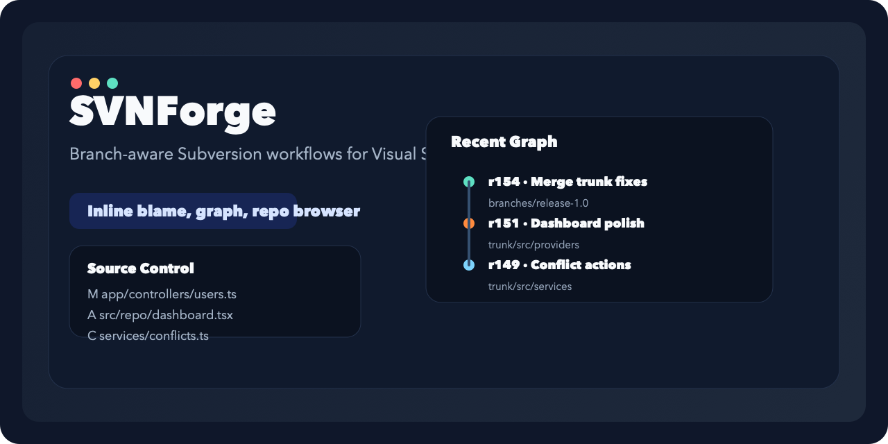
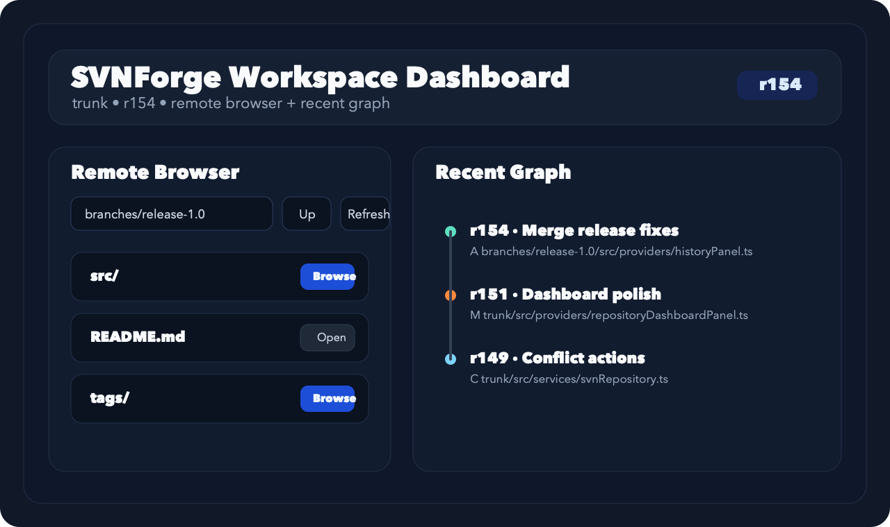

# SVNForge

SVNForge 是一个面向 Visual Studio Code 的 Apache Subversion 扩展，强调分支可视化、源码内责任追踪和远程仓库浏览，目标是提供接近 Git 原生体验的 SVN 工作流。

## 预览

核心界面包含：

- Source Control 集成：显示 SVN 状态、diff、提交入口和冲突操作
- Inline blame：在源码中直接看到行级责任信息，并通过 hover 查看 revision 详情
- Repository Dashboard：在同一个工作台中浏览远程仓库结构和近期提交图谱
- File History / Graph：查看文件级历史、按提交筛选日志和 revision 对比

当前版本已经实现以下能力：

- 基于 `svn` CLI 的 checkout、import、update、commit、switch、merge、patch、ignore、resolve 等命令封装
- Source Control 面板集成，展示 modified、added、deleted、conflicted、unversioned 状态
- 状态栏显示当前 SVN 路径和 revision
- Quick Diff 与工作副本/指定 revision 对比
- SQLite 本地日志缓存（基于 `sql.js`）和分页日志 / 文件历史面板
- 逐行 blame 装饰与 hover 提示
- 仓库浏览、branches/tags 树形浏览与创建分支/标签命令
- 冲突高亮、一键 accept mine / accept theirs / mark resolved
- 多工作区根目录下的独立仓库管理
- Jenkins 状态扩展点
- Repository Browser 支持仓库根、当前分支、trunk/branches/tags 书签和自定义远程 URL 固定入口
- svn:ignore 图形化管理支持建议条目、批量删除和批量替换
- 提供本地 SVN 烟测脚本、VS Code 调试配置和 VSIX 打包脚本
- 提供扩展宿主集成测试，覆盖仓库发现、日志/图谱/文件历史面板以及冲突解决命令
- 提供 Repository Dashboard Webview，将远程仓库浏览与提交图谱放在同一个工作台中

## 开发

1. 运行 `npm install`
2. 运行 `npm run compile`
3. 在 VS Code 中按 `F5` 启动扩展开发宿主

## 快速开始

1. 在 Extensions 开发宿主中打开一个 SVN working copy
2. 在 Source Control 面板中查看文件状态并输入提交信息
3. 使用命令面板运行 `SVN: Show Log`、`SVN: Show File History`、`SVN: Open Repository Browser`
4. 在编辑器标题栏启用 blame，并通过 hover 查看每一行对应的 revision / author / message

<!-- ### 调试

- `Run SVNForge`：先编译，再启动扩展开发宿主
- `Run SVNForge Watch`：启动 `tsc -watch` 后运行扩展宿主
- `npm run smoke:svn`：创建临时本地仓库，执行 checkout、commit、branch、switch、merge、ignore、patch 等真实 SVN 命令烟测
- `npm test`：启动 VS Code 扩展宿主并执行自动化集成测试

### 打包

- `npm run package:vsix`：编译并生成 VSIX 包
- `npm run publish:dry-run`：执行打包前检查并生成发布包，适合作为发布前自检

### CI

- GitHub Actions 工作流位于 `.github/workflows/ci.yml`
- 在 Linux 环境中安装 Subversion 后执行 compile、extension host tests、smoke tests 和 VSIX 打包
- `.github/workflows/publish.yml` 支持 tag 发布和手动触发发布
- 发布到 VS Code Marketplace 需要配置仓库 secret：`VSCE_PAT`

### GitHub Topics 建议

建议在 GitHub 仓库页面手动添加这些 topics：

- `svn`
- `subversion`
- `vscode-extension`
- `source-control`
- `typescript`

### VS Code Marketplace Secret

要让 GitHub Actions 自动发布到 VS Code Marketplace：

1. 打开仓库的 GitHub Actions secrets 页面
2. 新建仓库 secret：`VSCE_PAT`
3. 将你从 Visual Studio Marketplace 生成的 Personal Access Token 填入该 secret
4. 推送 `v*` tag 或手动触发 `publish` workflow
 -->
## 架构

- UI 层：SCM 资源组、树视图、状态栏、Webview 面板、blame/冲突装饰
- Service 层：仓库管理、日志缓存、CI 状态、命令协调
- SVN Adapter 层：`child_process` + `svn` CLI 调用与 XML 解析